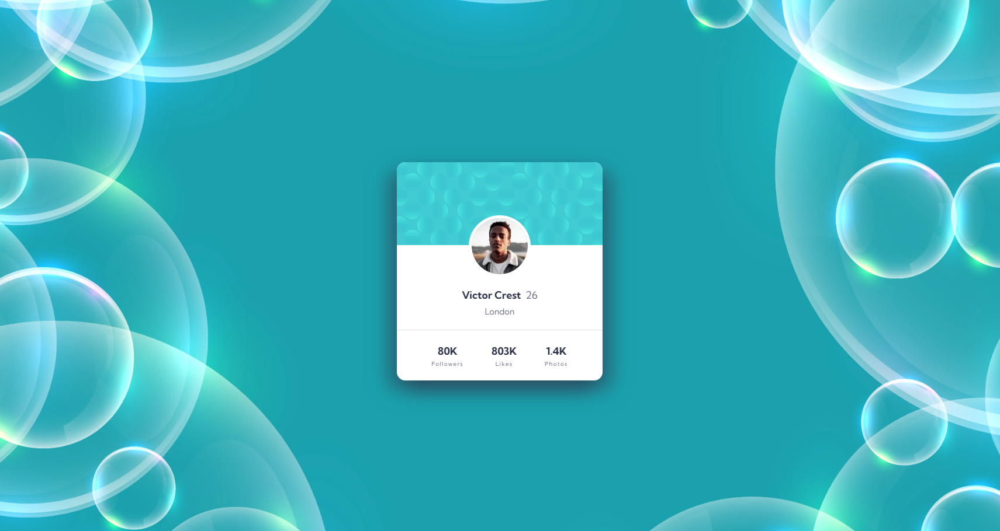

# Profile card component solution (HTML, SCSS)

## Table of contents

- [Overview](#overview)
  - [The challenge](#the-challenge)
  - [Links](#links)
- [My process](#my-process)
  - [Built with](#built-with)
  - [Continued development](#continued-development)
  - [Useful resources](#useful-resources)
- [Author](#author)

**Note: Delete this note and update the table of contents based on what sections you keep.**

## Overview

### The challenge

- Build out the project to the designs provided

Additionals:
- You can see additional hover effects on elements that could lead to additional information, like who liked the profile, follower details, photo portfolios, etc. These subtle interactions make the design more dynamic and ready for future functionality. 

### Links

- Solution URL: [Solution URL here](https://www.frontendmentor.io/solutions/interactive-nft-card-html-less-json-js--maqOBqwNK)
- Live Site URL: [Live site URL here](https://grimm-n.github.io/nft-preview-card-component/)

## My process

### Built with

- HTML5
- SCSS
- Flexbox
- Mobile-first workflow

### Continued development

My goal remains the same: to learn how to create perfectly mobile-adapted websites. I'm dedicated to mastering this skill.

### Useful resources

- [Freepick](https://www.freepik.com/) - I downloaded the backgroud image from this site.
- [A (more) Modern CSS Reset](https://piccalil.li/blog/a-more-modern-css-reset/) - Thanks again to Andy Bell for his wonderful cheat sheet! I'm using it, adapting it to my needs, and I highly recommend it to everyone.

## Author

- LinkedIn - [Natali Grimm](https://www.linkedin.com/in/grimm-n/)
- Frontend Mentor - [@Grimm-N](https://www.frontendmentor.io/profile/Grimm-N)
- Twitter - [@Grimm__N](https://x.com/Grimm__N)
